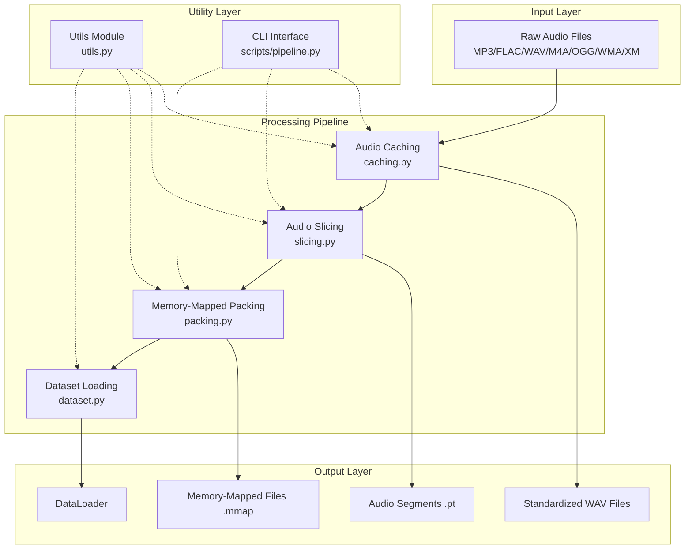
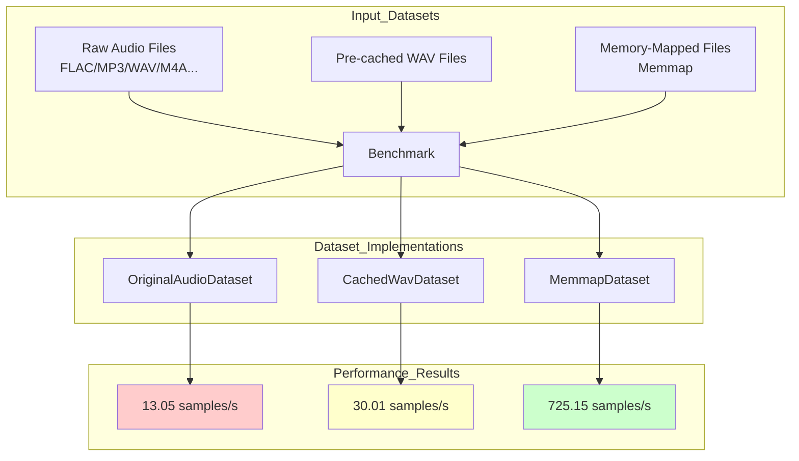

# pliteWAVpipeline

> Chinese version: [README_CN.md](./README_CN.md)

A comprehensive audio data processing pipeline designed for machine learning applications. Supports audio caching, intelligent slicing (based on VAD - Voice Activity Detection), memory-mapped file packaging, and efficient data loading. After normalization processing, supports splitting into segments, memory mapping for audio processing and model training.

Boost your data loading speed in the audio processing/training field — **55.54x faster** than origin WAV when loading.


## What It Can Do

- **🎵 Multiple Audio Formats**: Supports MP3, FLAC, WAV, M4A, OGG, WMA, XM, and more
- **🎯 Intelligent Speech Segmentation**: Segments based on energy threshold VAD (Voice Activity Detection)
- **💾 Memory-Mapped Packaging**: Packs audio fragments into memory-mapped files for efficient random access
- **📊 Various Dataset Types**: Supports fragmented datasets, memory-mapped datasets, and WAV datasets
- **⚡ Efficient Data Processing**: Optimized processing flow supporting large-scale audio datasets
- **🧩 Modular Design**: Each processing stage can be used independently or combined

## 🚀 Quick Start

### Installation

```bash
# Install from source
git clone https://github.com/KrOik/pliteWAVpipeline.git
cd pliteWAVpipeline
pip install -e .

# Or install from PyPI (when released)
pip install plitewavpipeline
```

### Using CLI Tools

```bash
# Run the complete pipeline
plitewav-run run --input_dir /path/to/audio --output_dir /path/to/output

# Or run step by step
plitewav-caching --input_dir /path/to/audio --output_dir /path/to/cache
plitewav-slice --input_dir /path/to/cache --output_dir /path/to/segments
plitewav-pack --input_dir /path/to/segments --output_dir /path/to/output
```

### Using Python API

```python
from plitewavpipeline import (
    cache_audio_files,
    cut_segments,
    pack_memmap,
    MemmapDataset,
)

# Step 1: Cache audio files
files = scan_files("/path/to/audio")
cache_audio_files(files, "cache_dir", sample_rate=48000)

# Step 2: Slice into segments
cut_segments(
    data_dirs="cache_dir",
    output_dir="segments_dir",
    sample_rate=48000,
    min_segment_s=5.0,
    max_segment_s=5.0,
)

# Step 3: Package into memory-mapped files
pack_memmap("segments_dir", "output_dir")

# Step 4: Load for training
from torch.utils.data import DataLoader

ds = MemmapDataset("output_dir/mmap")
loader = DataLoader(ds, batch_size=32, shuffle=True)

for batch in loader:
    # batch shape: (batch_size, channels, samples)
    pass
```

## 📋 System Requirements

- **Python**: >= 3.9
- **PyTorch**: >= 2.0.0
- **torchaudio**: >= 2.0.0
- **numpy**: >= 1.21.0
- **FFmpeg**

## 🏗️ Architecture Design

### Component Structure



### Data Processing Flow


## 📚 API Reference

### Caching Module (caching.py)

```python
from plitewavpipeline import cache_audio_files, scan_files

# Scan audio files
files = scan_files("/path/to/audio", exts=[".wav", ".flac", ".mp3"])

# Cache to standardized format
count = cache_audio_files(
    input_files=files,
    output_dir="cache_dir",
    sample_rate=48000,
    force_stereo=True,  # Convert mono to stereo
    check_quality=True,  # Check audio quality
)
```

### Slicing Module (slicing.py)

```python
from plitewavpipeline import cut_segments, EnergyVAD

# Use default VAD settings
result = cut_segments(
    data_dirs="cache_dir",
    output_dir="segments_dir",
    sample_rate=48000,
    min_segment_s=5.0,
    max_segment_s=5.0,
    silence_threshold_db=-35.0,
)

# Or use custom VAD
vad = EnergyVAD(
    sample_rate=48000,
    threshold_db=-35.0,  # More aggressive VAD
    min_silence_ms=300,
    analysis_frame_ms=30.0,
    analysis_hop_ms=10.0,
)
```

### Packing Module (packing.py)

```python
from plitewavpipeline import pack_memmap

# Sequential packing
pack_memmap("segments_dir", "output_dir")

# Quality-sorted packing with size limit
pack_memmap(
    "segments_dir",
    "output_dir",
    max_size="10G",  # Limit output size
    quality_sort=True,  # Prioritize high-quality segments
)
```

### Dataset Module (dataset.py)

```python
from plitewavpipeline import (
    MemmapDataset,
    MemmapSegmentDataset,
    SegmentShardDataset,
    WavSegmentDataset,
    create_dataloader,
)

# Auto-detect and create dataloader
loader = create_dataloader(
    "output_dir",
    batch_size=32,
    num_workers=4,
    shuffle=True,
)

# Or use specific dataset
ds = MemmapDataset("output_dir/mmap")        # Memory-mapped format
ds = MemmapSegmentDataset("output_dir/mmap") # Memory-mapped segmented format
ds = SegmentShardDataset("segments_dir")     # Sharded format
ds = WavSegmentDataset("wav_segments_dir")   # WAV segment format
```

## ⚙️ Configuration Parameters

### Default Parameters

| Parameter | Default | Description |
|-----------|---------|-------------|
| `sample_rate` | 48000 | Target sample rate |
| `min_segment_s` | 5.0 | Minimum segment duration (seconds) |
| `max_segment_s` | 10.0 | Maximum segment duration (seconds) |
| `silence_threshold_db` | -30.0 | VAD threshold (decibels) |
| `analysis_frame_ms` | 30.0 | VAD analysis frame size (milliseconds) |
| `analysis_hop_ms` | 10.0 | VAD analysis hop size (milliseconds) |
| `min_silence_ms` | 500 | Minimum silence duration (milliseconds) |
| `pcm_scale` | 32768.0 | PCM scale factor |

### CLI Options

```bash
# Full pipeline with all options
plitewav-run run \
    --input_dir /data/audio \
    --output_dir /data/processed \
    --work_dir /data/work \
    --sample_rate 48000 \
    --min_segment 5.0 \
    --max_segment 5.0 \
    --max_size 50G \
    --quality_sort \
    --cleanup
```

## 🧪 Performance Optimization

### Memory-Mapped Advantages
- **Zero-Copy Access**: Direct mapping from disk to memory, reducing memory copies
- **Fast Random Access**: Efficient random sampling of datasets
- **Large Dataset Support**: Can handle datasets larger than available memory

### Parallel Processing
- **Batch Processing**: Multi-threaded batch processing pipeline
- **Resource Control**: Configurable generated dataset size

## 🔧 Development Guide

### Project Structure
```
pliteWAVpipeline/
├── plitewavpipeline/          # Core Python package
│   ├── __init__.py           # Package initialization
│   ├── caching.py            # Audio caching module
│   ├── slicing.py            # Audio slicing module
│   ├── packing.py            # Memory-mapped packing module
│   ├── dataset.py            # Dataset loading module
│   └── utils.py              # Utility functions module
├── benchmark/                # Benchmark scripts
│   ├── benchmark.py
│   ├── charts.py
│   └── spectrogram.py
├── results/                  # Test results and charts
│   ├── benchmarkResults.json
│   ├── benchmarkBarChart.png
│   ├── benchmarkBoxPlot.png
│   ├── benchmarkCombined.png
│   ├── benchmarkSpeedup.png
│   ├── benchmarkViolinPlot.png
│   ├── spectrogramComparison.png
│   └── spectrograms/
│       ├── spectrogramSeg15.png
│       ├── spectrogramSeg16.png
│       ├── spectrogramSeg17.png
│       └── verificationSummary.json
├── scripts/                  # CLI scripts
│   ├── __init__.py
│   ├── pipeline.py           # Main pipeline script
│   └── verify_pipeline.py    # Data integrity verification
├── README.md                 # Project documentation (this file)
└── pyproject.toml            # Project configuration
```

### Extending with Custom Modules

```python
# Custom VAD implementation
class CustomVAD(EnergyVAD):
    def __init__(self, custom_param: float = 0.5, **kwargs):
        super().__init__(**kwargs)
        self.custom_param = custom_param
    
    def detect_voice_activity(self, audio: torch.Tensor) -> torch.Tensor:
        # Custom voice activity detection logic
        pass

# Custom dataset format
class CustomDataset(MemmapDataset):
    def __getitem__(self, index: int) -> Tuple[torch.Tensor, dict]:
        # Custom data loading logic
        pass
```

## 📊 Benchmark Results

### Benchmark Methodology

> **Reference**: Kalibera & Jones, "Rigorous Benchmarking in Reasonable Time" (ACM SIGPLAN 2013)

#### Statistical Rigor Design

| Feature | Implementation Details | Reason |
|---------|------------------------|--------|
| **30 measurement runs** | 30 independent measurements per test | Meets minimum requirements for reliable statistics |
| **Bootstrap confidence intervals** | 10,000 resamples for 95% CI | Quantifies measurement uncertainty, avoids normality assumption |
| **Welch's t-test** | Does not assume equal variances | Verifies statistical significance of performance differences |
| **Cohen's d effect size** | Quantifies practical effect magnitude | Distinguishes statistical vs. practical significance |
| **IQR outlier detection** | IQR method automatically removes anomalies | Prevents extreme values from skewing results |

#### Critical Design: Data Usage Verification

**⚠️ This is the most critical design in benchmarking**: The script forces actual data usage to prevent compiler/interpreter optimization from skipping real I/O operations:

```python
# CRITICAL: Force actual data usage to prevent compiler optimization
if isinstance(batch, list):
    _ = sum(b.sum() for b in batch)  # Ensure data is actually used
else:
    _ = batch.sum()
```

**Why this matters:**
- Modern compilers and JIT optimizers may identify "unused" variables and skip I/O operations
- Without this verification, we might measure "fake" performance rather than real I/O performance
- This design ensures we measure actual disk read and decode performance

#### Warmup Strategy

First perform 5 warmup runs before benchmarking starts to complete JIT compilation and warm up CPU/disk caches to steady state; then before each of the 30 measurement runs, clear system caches, create new DataLoader, and complete 1 iteration warmup to ensure timing measurements start from cold state, eliminating performance errors from uncleared caches.

> Test files contain system platform, Python version, PyTorch version, CPU/memory/disk information; sample spec: 5.0s, 48kHz, stereo, PCM 16-bit

---

### Benchmark Platform Information

#### Testing Environment
| Item | Specification |
|------|---------------|
| OS | Windows 11 (10.0.26200) |
| Python Version | 3.12.8 |
| PyTorch Version | 2.2.2+cpu |
| CPU | AMD64 Family 25 Model 117 (16 cores) |
| Total Memory | 13.76 GB (5.16 GB available) |
| Disk | 951.64 GB (SSD) |
| Test Dataset | 84 audio files (FLAC/MP3/XM, various formats) |
| Sample Spec | 5.0s, 48kHz, stereo, PCM 16-bit |

#### Test Configuration
| Parameter | Value |
|-----------|-------|
| Runs per test | 30 |
| Warmup runs | 5 |
| Uniform sample count | 84 |
| Batch Size | 8 |
| Workers | 0 |
| Random seed | 42 |
| Bootstrap resamples | 10,000 |

#### Throughput Comparison
> See `results/benchmark*.png` for details.

| Data Format | Avg Throughput | 95% CI | Median | Std Dev | Outliers |
|:------------|---------------:|-------:|-------:|--------:|---------:|
| **Original Audio** (flac/mp3/xm) | 13.05 s/s | [12.74, 13.39] | 12.91 | 0.89 | 1 |
| **Cached WAV** (segment) | 30.01 s/s | [29.70, 30.32] | 30.12 | 0.87 | 0 |
| **Memory Map** (mmap) | 725.15 s/s | [659.74, 790.66] | 694.99 | 183.70 | 0 |

#### Speedup Analysis


**Performance Speedup (vs. Original Audio)**

| Comparison | Speedup | 95% CI |
|:-----------|--------:|-------:|
| Cached WAV vs Original | **2.30x** | [2.24x, 2.37x] |
| Mmap vs Original | **55.54x** | [50.28x, 62.01x] |
| Mmap vs Cached WAV | **24.17x** | - |

#### Statistical Significance

| Comparison | p-value | Cohen's d | Significance |
|:-----------|--------:|----------:|:-------|
| Cached WAV vs Original | p < 0.01 | 19.52 | **Highly Significant (p<0.001)** |
| Mmap vs Original | p < 0.01 | 4.56 | **Highly Significant (p<0.001)** |

> **Note**: Cohen's d > 0.8 indicates very large effect size. Negative values indicate significant improvement.

#### Combined Results Chart


---

### Data Format & Pipeline

#### Benchmark Data Format Comparison



| Format Type | Dataset Class | Description |
|-------------|---------------|-------------|
| `original_audio` | `OriginalAudioDataset` | Load directly from original audio files (FLAC/MP3/WAV, etc.), requires decoding each time |
| `cached_wav` | `CachedWavDataset` | Load from pre-converted 16-bit WAV files, avoids format decoding |
| `mmap` | `MemmapDataset` | Direct random access from memory-mapped numpy arrays, no file I/O |

---

### Script Documentation

#### `scripts/pipeline.py` - Unified CLI Entry

Provides complete command-line interface, supporting individual steps or full pipeline:

```bash
# Full pipeline
python scripts/pipeline.py run -i /input/audio -o /output/mmap

# Individual steps
python scripts/pipeline.py cache -i /input -o /cache
python scripts/pipeline.py slice -i /cache -o /segments  
python scripts/pipeline.py pack -i /segments -o /mmap
```

#### `scripts/verify_pipeline.py` - Data Integrity Verification

Verifies consistency between mmap data and original audio:

```python
# Core verification metrics
- SNR (Signal-to-Noise Ratio): >60dB indicates high quality
- MSE (Mean Squared Error): Closer to 0 is better
- Spectrogram comparison: Visual verification of audio integrity
```

---

### Running Benchmarks

```bash
# Set data path environment variables
export AUDIO_BENCHMARK_ORIGINAL="./test_data/original"
export AUDIO_BENCHMARK_CACHED="./test_data/cached"
export AUDIO_BENCHMARK_MMAP="./test_data/mmap"

# Run benchmark
python benchmark/benchmark.py
```

### Benchmark JSON Result Structure

Raw test results and detailed platform information are saved in `results/benchmarkResults.json`.

---

### Pipeline Processing Performance

Test results for running the complete pipeline with different configurations:

| Test Scenario | Core Config | Processing Time | Output Size |
| :--- | :--- | :--- | :--- |
| **Standard Config** | 48kHz, stereo, 5s segments | ~101 seconds (1.7 min) | ~2.2 GB |
| **Mono Config** | 44.1kHz, mono, 3s segments | ~101 seconds (1.7 min) | ~2.0 GB |
| **Short Segments** | 48kHz, stereo, 2s segments | ~118 seconds (2.0 min) | ~2.2 GB |

> **Note**: Above tests include full time for audio caching, VAD intelligent slicing, and memory-mapped packing. Test conditions and platform are consistent with `results/benchmarkResults.json`.

### Performance Comparison
| Dataset Type | Load Speed | Random Access | Memory Efficiency |
|--------------|------------|---------------|-------------------|
| Original Audio | Slow | Poor | Low |
| Segmented Files (Cached WAV) | Medium | Good | Medium |
| Memory-Mapped (MMAP) | Fast | Excellent | High |

---

### Data Fidelity & Verification

To verify pipeline effectiveness, we ran the full processing pipeline on a single FLAC audio file and conducted restoration tests on the processed mmap data.

#### Verification Method

1. **Input**: `Give Me Something (for Arknights Endfield) - OneRepublic.flac`
2. **Processing**: Cache(WAV) → Slice(5s fixed length) → Pack(mmap)
3. **Verification**: Extract segments from the middle of the audio (Segments 15-17), load via MemmapDataset, compare with original audio
> Due to certain copyright issues, we are unable to share this FLAC music file. We sincerely apologize for this. You can use other audio tests instead.

#### Test Results

| Metric | Value |
|--------|-------|
| **Average SNR** | **72.44 dB** |
| **Average MSE** | **9.32×10⁻⁹** |
| **Average Max Difference** | **2.95×10⁻²** |

#### Detailed Results by Segment

| Segment | SNR (dB) | MSE | Max Diff |
|---------|----------|-----|----------|
| 15 | 67.62 | 2.23e-08 | 4.85e-02 |
| 16 | 78.00 | 8.27e-10 | 1.28e-02 |
| 17 | 71.71 | 4.82e-09 | 2.72e-02 |

#### Spectrogram Comparison

Comparison between original FLAC audio processed through the pipeline and restored audio from mmap:


**Top: Original Audio | Bottom: Restored Audio from mmap**

## 📄 License

This project is licensed under the GNU Affero General Public License v3.0 (AGPLv3) - see the [LICENSE](LICENSE) file for details.

## 🤝 Contributing

Contributions are welcome! Please feel free to submit a Pull Request.

### Development Process
1. Fork the project
2. Create your feature branch (`git checkout -b feature/AmazingFeature`)
3. Commit your changes (`git commit -m 'Add some AmazingFeature'`)
4. Push to the branch (`git push origin feature/AmazingFeature`)
5. Open a Pull Request

---

### Request for Additional Information / Usage in Model Training

If you would like to request more information or obtain relevant files for usage in specific model training, please contact me via the email below:
- Email: Krnormy@gmail.com

Alternatively, you can also open a new issue in this repository, leave your request details and your contact email, and I will respond as soon as possible.

---

**pliteWAVpipeline**