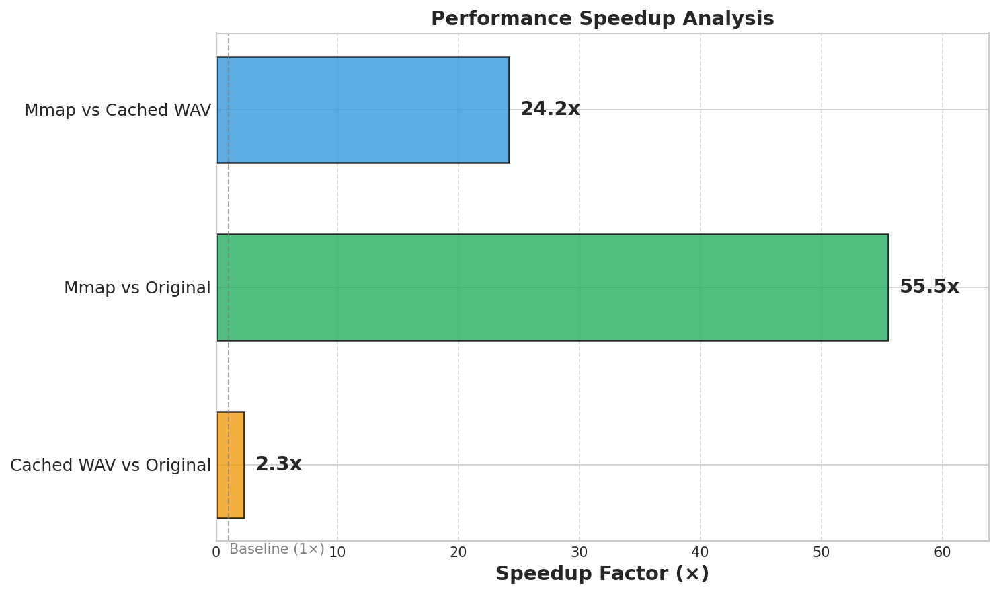
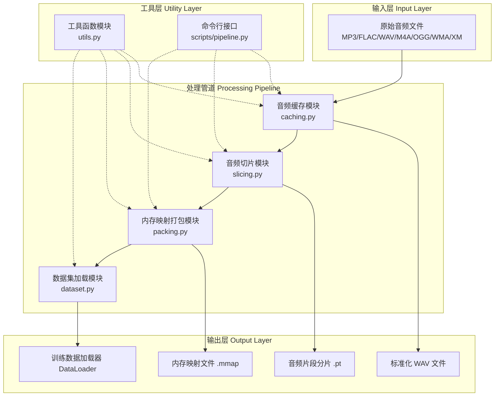
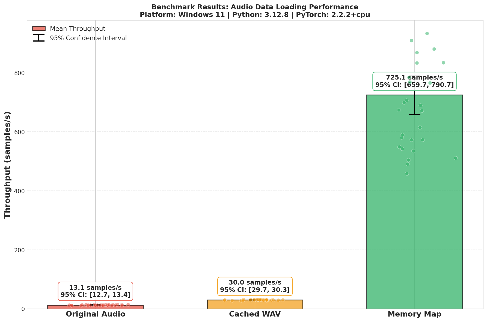
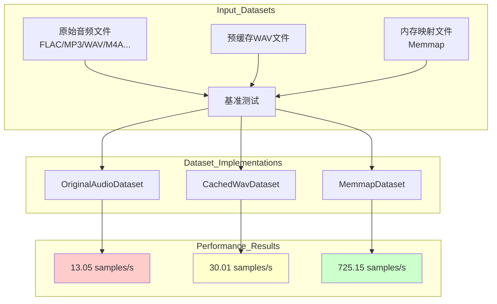
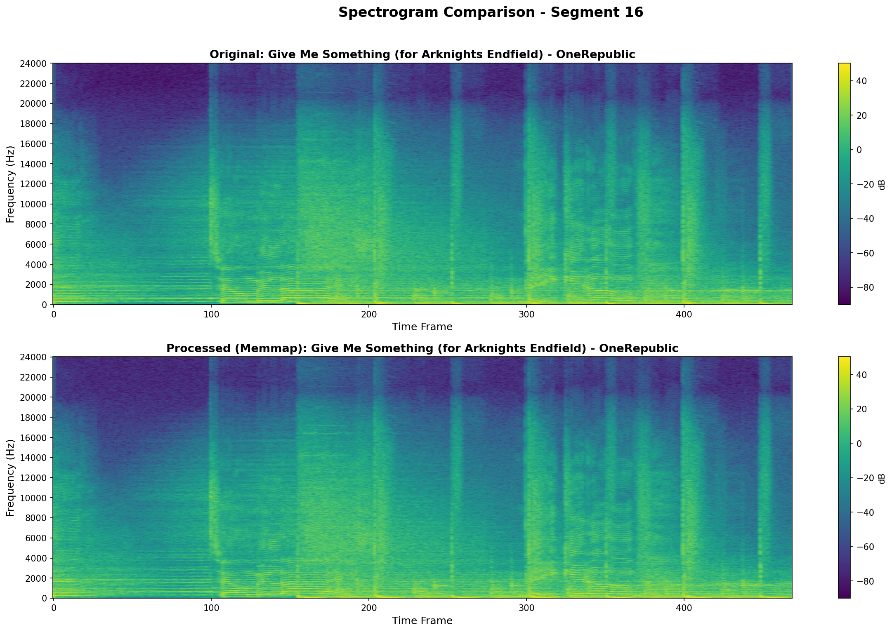

# pliteWAVpipeline

一个全面的音频数据处理管道，专为机器学习应用设计。支持音频缓存、智能切片（基于 VAD - Voice Activity Detection）、内存映射文件打包和高效数据加载。归一化处理完成后，支持切分到 segment，mmap 到内存，用于音频处理领域模型训练。
Boost your data loading speed in the audio processing/training field — 55.54x faster than origin WAV when loading.


## What it can do 核心特性

- **🎵 Support for multiple audio formats**: Supports MP3, FLAC, WAV, M4A, OGG, WMA, XM, etc. various audio formats
- **🔧 Intelligent audio caching**: Converts various audio formats into standardized PCM 16-bit WAV format
- **🎯 Intelligent speech segmentation**: Segments based on energy threshold detection VAD (Voice Activity Detection)
- **💾 Memory-mapped packaging**: Packs audio fragments into memory-mapped files for efficient random access
- **📊 Various data set types**: Supports fragmented data sets, memory-mapped data sets, and WAV data sets
- **⚡ Efficient data processing**: Optimized data processing flow, supporting large-scale audio data sets
- **🧩 Modular design**: Each processing stage can be used independently or combined together

## 🚀 快速开始

### 安装

```bash
# 从源码安装
git clone https://github.com/KrOik/pliteWAVpipeline.git
cd pliteWAVpipeline
pip install -e .

# 或者从 PyPI 安装（发布后）
pip install plitewavpipeline
```

### 使用 CLI 工具

```bash
# 运行完整管道
plitewav-run run --input_dir /path/to/audio --output_dir /path/to/output

# 或者分步运行
plitewav-caching --input_dir /path/to/audio --output_dir /path/to/cache
plitewav-slice --input_dir /path/to/cache --output_dir /path/to/segments
plitewav-pack --input_dir /path/to/segments --output_dir /path/to/output
```

### 使用 Python API

```python
from plitewavpipeline import (
    cache_audio_files,
    cut_segments,
    pack_memmap,
    MemmapDataset,
)

# 步骤 1: 缓存音频文件
files = scan_files("/path/to/audio")
cache_audio_files(files, "cache_dir", sample_rate=48000)

# 步骤 2: 切片成片段
cut_segments(
    data_dirs="cache_dir",
    output_dir="segments_dir",
    sample_rate=48000,
    min_segment_s=5.0,
    max_segment_s=5.0,
)

# 步骤 3: 打包成内存映射文件
pack_memmap("segments_dir", "output_dir")

# 步骤 4: 加载用于训练
from torch.utils.data import DataLoader

ds = MemmapDataset("output_dir/mmap")
loader = DataLoader(ds, batch_size=32, shuffle=True)

for batch in loader:
    # batch 形状: (batch_size, channels, samples)
    pass
```

## 📋 系统要求

- **Python**: >= 3.9
- **PyTorch**: >= 2.0.0
- **torchaudio**: >= 2.0.0
- **numpy**: >= 1.21.0
- **FFmpeg**

## 🏗️ How it desgin 架构设计

### 组件结构图



### 数据处理流程


## 📚 API 参考

### 缓存模块 (caching.py)

```python
from plitewavpipeline import cache_audio_files, scan_files

# 扫描音频文件
files = scan_files("/path/to/audio", exts=[".wav", ".flac", ".mp3"])

# 缓存到标准化格式
count = cache_audio_files(
    input_files=files,
    output_dir="cache_dir",
    sample_rate=48000,
    force_stereo=True,  # 将单声道转换为立体声
    check_quality=True,  # 检查音频质量
)
```

### 切片模块 (slicing.py)

```python
from plitewavpipeline import cut_segments, EnergyVAD

# 使用默认 VAD 设置
result = cut_segments(
    data_dirs="cache_dir",
    output_dir="segments_dir",
    sample_rate=48000,
    min_segment_s=5.0,
    max_segment_s=5.0,
    silence_threshold_db=-35.0,
)

# 或者使用自定义 VAD
vad = EnergyVAD(
    sample_rate=48000,
    threshold_db=-35.0,  # 更激进的 VAD
    min_silence_ms=300,
    analysis_frame_ms=30.0,
    analysis_hop_ms=10.0,
)
```

### 打包模块 (packing.py)

```python
from plitewavpipeline import pack_memmap

# 顺序打包
pack_memmap("segments_dir", "output_dir")

# 质量排序打包，带大小限制
pack_memmap(
    "segments_dir",
    "output_dir",
    max_size="10G",  # 限制输出大小
    quality_sort=True,  # 优先处理高质量片段
)
```

### 数据集模块 (dataset.py)

```python
from plitewavpipeline import (
    MemmapDataset,
    MemmapSegmentDataset,
    SegmentShardDataset,
    WavSegmentDataset,
    create_dataloader,
)

# 自动检测并创建数据加载器
loader = create_dataloader(
    "output_dir",
    batch_size=32,
    num_workers=4,
    shuffle=True,
)

# 或者使用特定数据集
ds = MemmapDataset("output_dir/mmap")        # 内存映射格式
ds = MemmapSegmentDataset("output_dir/mmap") # 内存映射分片格式
ds = SegmentShardDataset("segments_dir")    # 分片格式
ds = WavSegmentDataset("wav_segments_dir")   # WAV 片段格式
```

## ⚙️ 配置参数

### 默认参数

| 参数 | 默认值 | 描述 |
|------|--------|------|
| `sample_rate` | 48000 | 目标采样率 |
| `min_segment_s` | 5.0 | 最小片段时长（秒） |
| `max_segment_s` | 10.0 | 最大片段时长（秒） |
| `silence_threshold_db` | -30.0 | VAD 阈值（分贝） |
| `analysis_frame_ms` | 30.0 | VAD 分析帧大小（毫秒） |
| `analysis_hop_ms` | 10.0 | VAD 分析跳跃大小（毫秒） |
| `min_silence_ms` | 500 | 最小静音时长（毫秒） |
| `pcm_scale` | 32768.0 | PCM 缩放因子 |

### CLI 选项

```bash
# 完整管道包含所有选项
plitewav-run run \
    --input_dir /data/audio \
    --output_dir /data/processed \
    --work_dir /data/work \
    --sample_rate 48000 \
    --min_segment 5.0 \
    --max_segment 5.0 \
    --max_size 50G \
    --max_size 50G \
    --quality_sort \
    --cleanup
```

## 🧪 Why it so fast 性能优化

### 内存映射优势
- **零拷贝访问**: 直接从磁盘映射到内存，减少内存复制
- **快速随机访问**: 支持高效的数据集随机采样
- **大数据集支持**: 可以处理超过内存限制的大型数据集

### 并行处理

- **批量处理**: 多线程加速的批量处理流水线
- **资源控制**: 可定量配置的生成数据集大小

## 🔧 开发指南

### 项目结构
```
pliteWAVpipeline/
├── plitewavpipeline/          # 核心 Python 包
│   ├── __init__.py           # 包初始化文件
│   ├── caching.py            # 音频缓存模块
│   ├── slicing.py            # 音频切片模块
│   ├── packing.py            # 内存映射打包模块
│   ├── dataset.py            # 数据集加载模块
│   └── utils.py              # 工具函数模块
├── benchmark/                # 基准测试脚本
│   ├── benchmark.py
│   ├── charts.py
│   └── spectrogram.py
├── results/                  # 测试结果与图表
│   ├── benchmarkResults.json
│   ├── benchmarkBarChart.png
│   ├── benchmarkBoxPlot.png
│   ├── benchmarkCombined.png
│   ├── benchmarkSpeedup.png
│   ├── benchmarkViolinPlot.png
│   ├── spectrogramComparison.png
│   └── spectrograms/
│       ├── spectrogramSeg15.png
│       ├── spectrogramSeg16.png
│       ├── spectrogramSeg17.png
│       └── verificationSummary.json
├── scripts/                  # 命令行脚本
│   ├── __init__.py
│   ├── pipeline.py           # 主管道脚本
│   └── verify_pipeline.py    # 数据完整性验证
├── README.md                 # 项目说明文档
└── pyproject.toml            # 项目配置
```

### 扩展自定义模块

```python
# 自定义 VAD 实现
class CustomVAD(EnergyVAD):
    def __init__(self, custom_param: float = 0.5, **kwargs):
        super().__init__(**kwargs)
        self.custom_param = custom_param
    
    def detect_voice_activity(self, audio: torch.Tensor) -> torch.Tensor:
        # 自定义语音活动检测逻辑
        pass

# 自定义数据集格式
class CustomDataset(MemmapDataset):
    def __getitem__(self, index: int) -> Tuple[torch.Tensor, dict]:
        # 自定义数据加载逻辑
        pass
```

## 📊 Benchmark 性能基准与测试报告

### 测试方法论 (Benchmark Methodology) - 脚本严谨性重点说明

> **参考**: Kalibera & Jones, "Rigorous Benchmarking in Reasonable Time" (ACM SIGPLAN 2013) 并构建了基准测试 (`benchmark/benchmark.py`) 

#### 🔬 统计学严谨性设计

| 特性 | 实现细节 | 原因 |
|------|----------|----------|
| **30次测量运行** | 每个测试进行30次独立测量 | 满足可靠统计的最低要求 |
| **Bootstrap置信区间** | 10,000次重采样计算95%CI | 量化测量不确定性，避免正态假设 |
| **Welch's t检验** | 不假设等方差的统计检验 | 验证性能差异的统计显著性 |
| **Cohen's d效应量** | 量化实际效应大小 | 区分统计显著与实际显著差异 |
| **IQR离群值检测** | 四分位距方法自动移除异常值 | 防止极端值扭曲结果 |

#### 🔒 关键设计：数据使用验证（防止编译器优化）

**⚠️ 这是基准测试中最关键的设计**：脚本强制实际使用加载的数据，防止编译器/解释器优化掉真实的IO操作：

```python
# CRITICAL: Force actual data usage to prevent compiler optimization
if isinstance(batch, list):
    _ = sum(b.sum() for b in batch)  # 确保数据被实际使用
else:
    _ = batch.sum()
```

**为什么这很重要？**
- 现代编译器和JIT优化可能会识别"未使用"的变量并跳过IO操作
- 没有这种验证，测量的可能是"虚假"性能而非真实IO性能
- 这种设计确保我们测量的是真实的磁盘读取和解码性能

#### 🌡️ 预热机制 (Warmup) 设计

预热策略：首先在基准测试开始前执行5次预热运行，使JIT编译完成、CPU/磁盘缓存充分预热至稳态；随后在30次测量运行的每次迭代前，先清空系统缓存、创建新DataLoader并完成1次迭代预热，确保计时测量从冷启动状态开始，排除缓存未清除带来的性能误差。

> 测试文件中包含系统平台、Python版本、PyTorch版本、CPU/内存/磁盘信息，供您参考；样本规格使用5.0s, 48kHz, 立体声, PCM 16-bit

---

### 基准测试平台信息

#### 测试环境 (Testing Platform)
| 项目 | 规格 |
|------|------|
| 操作系统 | Windows 11 (10.0.26200) |
| Python 版本 | 3.12.8 |
| PyTorch 版本 | 2.2.2+cpu |
| CPU | AMD64 Family 25 Model 117 (16核心) |
| 内存总量 | 13.76 GB (可用 5.16 GB) |
| 磁盘 | 951.64 GB (SSD) |
| 测试数据集 | 84 个音频文件（FLAC/MP3/XM 等多种格式） |
| 样本规格 | 5.0s, 48kHz, 立体声, PCM 16-bit |

#### 测试配置
| 参数 | 值 |
|------|-----|
| 每次测试运行次数 | 30 |
| 预热次数 | 5 |
| 统一采样数 | 84 |
| Batch Size | 8 |
| Workers | 0 |
| 随机种子 | 42 |
| Bootstrap重采样 | 10,000次 |

#### 吞吐量对比 (Throughput Comparison)
> pls refer to `results/benchmark*.png` for detail.

| 数据格式 | 平均吞吐量 | 95% 置信区间 | 中位数 | 标准差 | 异常值剔除 |
|:---------|----------:|-------------:|-------:|-------:|----------:|
| **原始音频** (flac/mp3/xm) | 13.05 s/s | [12.74, 13.39] | 12.91 | 0.89 | 1 |
| **Cached WAV** (segment) | 30.01 s/s | [29.70, 30.32] | 30.12 | 0.87 | 0 |
| **Memory Map** (mmap) | 725.15 s/s | [659.74, 790.66] | 694.99 | 183.70 | 0 |

#### 加速比分析 (Speedup Analysis)


**图4：性能加速比分析（相比原始音频）**

| 对比基准 | 加速比 | 95% 置信区间 |
|:---------|-------:|------------:|
| Cached WAV vs 原始音频 | **2.30x** | [2.24x, 2.37x] |
| Mmap vs 原始音频 | **55.54x** | [50.28x, 62.01x] |
| Mmap vs Cached WAV | **24.17x** | - |

#### 统计显著性检验 (Statistical Significance)

| 对比 | p-value | Cohen's d | 显著性 |
|:-----|--------:|----------:|:-------|
| Cached WAV vs 原始音频 | p < 0.01 | 19.52 | **极显著 (p<0.001)** |
| Mmap vs 原始音频 | p < 0.01 | 4.56 | **极显著 (p<0.001)** |

> **注**: Cohen's d > 0.8 表示效应量极大。负值表示前者相比后者有显著提升。

#### 综合结果图表



**图5：综合结果图（柱状图+误差棒+原始数据点）**

---

### 测试数据格式与流程

#### 基准测试数据格式对比




| 格式类型 | 数据集类 | 描述 |
|---------|----------|------|
| `original_audio` | `OriginalAudioDataset` | 直接从原始音频文件(FLAC/MP3/WAV等)加载，每次需要解码 |
| `cached_wav` | `CachedWavDataset` | 从预转换的16-bit WAV文件加载，避免格式解码 |
| `mmap` | `MemmapDataset` | 从内存映射的numpy数组直接随机访问，无需文件IO |

---

### 脚本文件说明

#### `scripts/pipeline.py` - 统一CLI入口

提供完整的命令行接口，支持独立步骤或完整流水线：

```bash
# 完整流水线
python scripts/pipeline.py run -i /input/audio -o /output/mmap

# 单独步骤
python scripts/pipeline.py cache -i /input -o /cache
python scripts/pipeline.py slice -i /cache -o /segments  
python scripts/pipeline.py pack -i /segments -o /mmap
```

#### `scripts/verify_pipeline.py` - 数据完整性验证

验证mmap数据与原始音频的一致性：

```python
# 核心验证指标
- SNR (信噪比): >60dB 表示高质量
- MSE (均方误差): 越接近0越好
- 频谱对比: 可视化验证音频完整性
```

---

### 运行基准测试

```bash
# 设置数据路径环境变量
export AUDIO_BENCHMARK_ORIGINAL="./test_data/original"
export AUDIO_BENCHMARK_CACHED="./test_data/cached"
export AUDIO_BENCHMARK_MMAP="./test_data/mmap"

# 运行基准测试
python benchmark/benchmark.py
```

### 基准测试JSON结果结构

原始测试结果和详细平台信息保存在 `results/benchmarkResults.json`，供您审阅：

---

### 管道处理性能

以下是在不同配置下运行完整管道的测试结果：

| 测试场景 | 核心配置 | 处理耗时 | 输出大小 |
| :--- | :--- | :--- | :--- |
| **标准配置 (Default)** | 48kHz, 立体声, 5s 切片 | ~101 秒 (1.7 分钟) | ~2.2 GB |
| **单声道配置 (Mono)** | 44.1kHz, 单声道, 3s 切片 | ~101 秒 (1.7 分钟) | ~2.0 GB |
| **短片段配置 (Short)** | 48kHz, 立体声, 2s 切片 | ~118 秒 (2.0 分钟) | ~2.2 GB |

> **注意**: 以上测试包含了音频缓存 (Caching)、VAD 智能切片 (Slicing) 和内存映射打包 (Packing) 的完整耗时，测试条件和平台与`results/benchmarkResults.json`保持一致

### 性能对比
| 数据集类型 | 加载速度 | 随机访问 | 内存效率 |
|------------|----------|----------|----------|
| 原始音频 | 慢 | 差 | 低 |
| 分片文件 (Cached WAV) | 中等 | 好 | 中等 |
| 内存映射 (MMAP) | 快 | 优秀 | 高 |

---

### 数据一致性验证 (Data Fidelity & Verification)

为了验证管线的有效性，我们使用单一FLAC音频文件完整运行了处理管线，并对处理后的 `mmap` 数据进行了还原测试。`benchmark\spectrogram.py`

#### 验证方法

1. **输入文件**: `Give Me Something (for Arknights Endfield) - OneRepublic.flac` 
2. **处理流程**: 缓存(WAV) → 切片(5s固定长度) → 打包(mmap)
3. **验证方式**: 抽取**乐曲中部片段**（Segment 15-17），使用MemmapDataset加载，与原始音频进行对比分析
> Due to certain copyright issues, we are unable to share this FLAC music file. We sincerely apologize for this. You can use other audio tests instead.

#### 测试结果

| 指标 | 数值 |
|------|------|
| **平均 SNR** | **72.44 dB** |
| **平均 MSE** | **9.32×10⁻⁹** |
| **平均最大差异** | **2.95×10⁻²** |

#### 各片段详细结果

| Segment | SNR (dB) | MSE | Max Diff |
|---------|----------|-----|----------|
| 15 | 67.62 | 2.23e-08 | 4.85e-02 |
| 16 | 78.00 | 8.27e-10 | 1.28e-02 |
| 17 | 71.71 | 4.82e-09 | 2.72e-02 |

#### 频谱对比图 (Spectrogram Comparison)

以下是原始FLAC音频经过管线处理后，从mmap还原的音频与原始音频的频谱对比：



**图：原始音频（上）与从 mmap 还原的音频（下）频谱对比**


## 📄 许可证

本项目采用 GNU Affero General Public License v3.0 (AGPLv3) 许可证 - 详见 [LICENSE](LICENSE) 文件。

## 🤝 贡献指南

欢迎贡献代码！请随时提交 Pull Request。

### 开发流程
1. Fork 本项目
2. 创建特性分支 (`git checkout -b feature/AmazingFeature`)
3. 提交更改 (`git commit -m 'Add some AmazingFeature'`)
4. 推送到分支 (`git push origin feature/AmazingFeature`)
5. 打开 Pull Request


### Request for Additional Information / Usage in Model Training
If you would like to request more information or obtain relevant files for the usage in specific model training, please contact me via the email below to get the files:
- Email: Krnormy@gmail.com

Alternatively, you can also open a new issue in this repository, leave your request details and your contact email, and I will respond to you as soon as possible.

---

**pliteWAVpipeline**